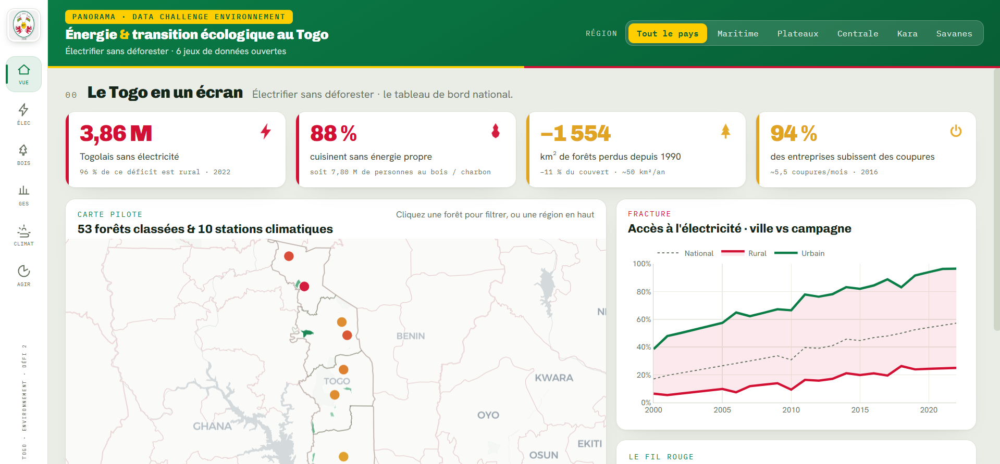

# PANORAMA - Énergie & transition écologique au Togo

Tableau de bord interactif du **Défi 2 (Environnement)** du Data Challenge de Togo AI Lab / MESPTN.
Fil conducteur : **électrifier le Togo sans déforester**.

Développé par **Bastou OURO-TAGBA**.

## 🔗 Dashboard en ligne

**[▶ Ouvrir le tableau de bord interactif](https://togo-environnement-fefi2.onrender.com/)**

[](https://togo-environnement-fefi2.onrender.com/)

> Cliquez sur l'image pour voir le dashboard.
> _(Hébergement gratuit : la première ouverture peut prendre ~30-60 s, le temps que le serveur se réveille.)_

## Lancer en local

```bash
pip install -r requirements.txt
python app.py
```

Puis ouvrir **http://127.0.0.1:8050**.

> Application **Python / Dash**. La carte utilise un fond de plan en ligne (Carto / MapLibre) :
> une connexion internet est recommandée.

## Structure

```
TOGO-ENVIRONNEMENT 2/
├── app.py                    application Dash (6 sections + carte pilote + filtre région)
├── requirements.txt          dépendances
├── render.yaml               configuration de déploiement (Render)
├── assets/                   servi automatiquement par Dash
│   ├── style.css             charte visuelle (couleurs du drapeau togolais)
│   ├── logo.jpg              armoiries de la République togolaise
│   └── icons/                icônes PNG des KPI et des leviers
├── data/
│   ├── donnees_brutes/       6 jeux du défi + 1 métadonnée + 1 source externe (frontières)
│   ├── *.csv, kpis.json      tables nettoyées lues par l'app
│   ├── forets.geojson        53 forêts classées (géométries)
│   └── togo_regions.geojson  frontières des 5 régions (ajout externe, cartographie)
├── images/                   Panorama.png (aperçu), logo.jpg
├── notebooks/
│   ├── 00_profiling.py        exploration des 6 sources
│   └── 01_build_app_data.py   nettoyage -> data/
├── rapport/                  PANORAMA_Rapport.pptx (rapport 10 slides)
└── DEFI ENV2.pdf             énoncé du défi
```

## Les 6 sections

1. **Vue** - le Togo en un écran (KPI, carte pilote, fracture électrique)
2. **Élec** - accès ville/campagne, projection d'accès universel, fiabilité du réseau
3. **Bois** - cuisson au bois, biomasse, recul des forêts, 53 forêts classées
4. **GES** - émissions par secteur, CO₂ de l'électricité
5. **Climat** - gradient Sud/Nord et tendance de température (10 villes)
6. **Agir** - 4 leviers de recommandation

Le **filtre région** (en haut) et le **clic sur la carte** recalculent les vues là où la donnée
existe au niveau régional (forêts, climat).

## Provenance des données

Toutes les analyses dérivent des **6 jeux de données ouverts** du défi (opendata.gouv.tg /
World Development Indicators, Banque mondiale). Un **seul ajout externe**, purement cartographique :
`togo_regions.geojson`, les frontières des 5 régions (source publique geoBoundaries), utilisé
uniquement pour tracer les contours sur la carte.

Régénérer les tables : `python notebooks/01_build_app_data.py`.

## Déploiement

L'application est déployée sur **Render** (`render.yaml`), servie via **gunicorn** :
`gunicorn app:server --bind 0.0.0.0:$PORT`.
